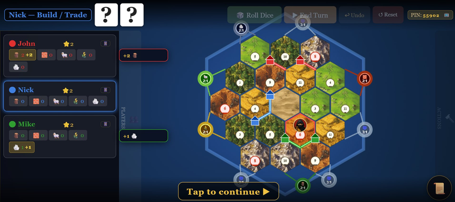

# 🎲 Catan Web

A full web-based multiplayer implementation of Settlers of Catan, playable from any browser — no app required.



## Features

- **2–4 players** — each player joins from their own device
- **Admin view** — full board on desktop, manages the game
- **📱 Mobile player** — each player scans a QR code and plays from their phone
- **💻 Web player** — join via link on PC or tablet, with full turn management
- **📺 Spectator mode** — TV/projector view via `/spectator?pin=XXXXX`, auto-updating
- **📱 Phone-only mode** — start a game without a desktop board; all players join via QR from their phones
- **Skin system** — Classic Catan skin with illustrated hex tiles, 3D-printed pieces and roads; fully customizable
- **Undo** — available during setup and main game
- **Languages** — EN, IT, FR, DE (auto-detected from browser)
- **PWA** — installable on mobile as a full-screen app

## Game rules options

| Option | Description |
|--------|-------------|
| Start without resources | Players begin with no resources from initial settlements |
| Random ports | Port positions are randomized |
| Random numbers | Number tokens are placed randomly instead of the standard spiral |
| Desert center | Desert is always placed at the center hex |
| ⚡ Quick Game | Win at 7 points instead of 10 |

## How to play

### Standard (admin on desktop)

1. Open the game on a desktop browser — this is the **Admin** view
2. Set player names and colors, choose skin and rules
3. Click **Start Game** — a PIN is generated
4. Each player scans the **QR code** (phone → mobile interface) or copies the **Web link** (PC/tablet)
5. Play!

### Phone-only mode (mobile admin)

1. Open the game on a phone
2. Configure players and rules as usual
3. Tap **📱 Gioca da telefono** — a compact host screen appears
4. Each player taps **QR** to scan their personal link, or **🔗** to open it directly
5. Everyone plays from their own phone — no desktop board needed

### Rejoin after reload

If the admin closes or refreshes the page, navigate to `/?pin=XXXXX` (the PIN is shown in the top bar) to rejoin the existing game.

## Skins

Place skin folders inside `skins/` — each with a `skin.json` manifest.

A skin can provide any combination of: `hex` textures, `robber` image, `buildings` (settlement + city per color), `roads` (per color).

```
skins/
└── myskin/
    ├── skin.json
    ├── preview.png
    ├── hex/
    │   └── wood.png  brick.png  sheep.png  wheat.png  ore.png  desert.png
    ├── buildings/
    │   └── settlement_red.png  city_red.png  (+ blue, green, yellow)
    └── roads/
        └── road_red.png  (+ blue, green, yellow)
```

`skin.json` example:
```json
{
  "id": "myskin",
  "name": "My Skin",
  "version": "1.0",
  "preview": "preview.png",
  "provides": ["hex", "robber", "buildings", "roads"],
  "hex": {
    "wood": "hex/wood.png",
    "brick": "hex/brick.png",
    "sheep": "hex/sheep.png",
    "wheat": "hex/wheat.png",
    "ore":   "hex/ore.png",
    "desert":"hex/desert.png"
  },
  "robber": "robber.png",
  "buildings": {
    "settlement": { "red": "buildings/settlement_red.png", "blue": "...", "green": "...", "yellow": "..." },
    "city":       { "red": "buildings/city_red.png",       "blue": "...", "green": "...", "yellow": "..." }
  },
  "roads": {
    "red": "roads/road_red.png", "blue": "...", "green": "...", "yellow": "..."
  }
}
```

## Debug mode

Open `/?debug=1` to show a debug panel in the setup screen.

### Force first dev card

| Button | Card |
|--------|------|
| 👑 Monopolio | Monopoly — steal all of one resource from everyone |
| ⚔️ Cavaliere | Knight — move robber |
| 🛤 Strade | Road Building — place 2 free roads |
| 🌻 Abbondanza | Year of Plenty — take any 2 resources |
| ⭐ Vittoria | Victory Point — +1 secret point |

### Other debug options

- **💰 10 risorse iniziali** — all players start with 10 of each resource when the main phase begins
- **🎲 Forza dado** — force a specific dice total (2–12) on every roll; useful for testing the robber (force 7)

A red banner `🐛 DEBUG: ...` appears at the top confirming active debug options.

> Debug mode is invisible in normal play (`/?` without `debug=1`).

## Setup

```bash
npm install
node server/index.js
```

Open `http://localhost:3000` in your browser.

## Deploy

Tested on [Render](https://render.com) — set start command to `node server/index.js`.

Demo: [https://catan-vk1j.onrender.com](https://catan-vk1j.onrender.com)
